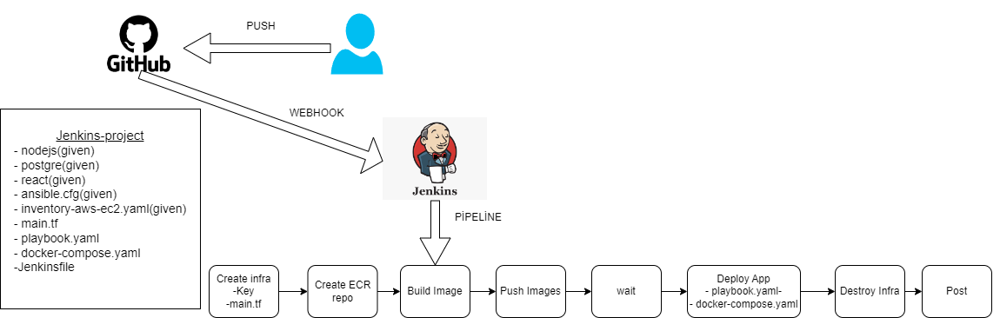

# Todo List Application - CI/CD with Jenkins, Terraform, Ansible, and Docker

End-to-end DevOps project demonstrating infrastructure provisioning with Terraform, server configuration with Ansible, containerized application deployment with Docker Compose, and CI/CD automation using Jenkins on AWS EC2.

## Key Highlights
- Infrastructure provisioning with Terraform (AWS EC2, Security Groups, IAM)
- Configuration management with Ansible
- CI/CD pipeline implemented using Jenkins
- Containerized full-stack application (React + Node.js + PostgreSQL)
- Docker Compose-based deployment
- AWS ECR authentication for container workflows

---

## Infrastructure (Terraform - `main.tf`)

### Provider Configuration
- **Provider:** AWS (HashiCorp)
- **Version:** `~> 5.45.0`
- **Region:** `us-east-1`

### Variables
- **key:** `jenkins-project`  
  Used as the SSH key pair name for EC2 access.
- **user:** `techpro`  
  Used for user-specific naming and configuration.

### EC2 Instance
- **Resource:** `aws_instance`
- **Instance Type:** `t2.micro`
- **AMI:** `ami-0230bd60aa48260c6`
- **IAM Role:** `jenkins-project-profile-techpro`
- **Tags:**
  - `Name = jenkins_project`

### Security Group
- **Name:** `project-jenkins-sec-gr`

#### Ingress Rules
- `22` - SSH access
- `5000` - Backend API (Node.js)
- `3000` - Frontend (React)
- `5432` - PostgreSQL

#### Egress Rules
- Allow all outbound traffic (`0.0.0.0/0`)

### Outputs
- **node_public_ip**  
  Public IP address of the provisioned EC2 instance

---

## Configuration Management (Ansible - `playbook.yaml`)

The Ansible playbook prepares the EC2 instance for containerized workloads.

### Tasks Overview

- Update system packages
- Remove legacy Docker packages
- Install required system utilities
- Install and configure Docker
- Add `ec2-user` to Docker group
- Enable Docker service on boot
- Install Docker Compose
- Authenticate Docker with AWS ECR
- Copy `docker-compose.yml` to the server
- Start the application using Docker Compose (detached mode)

---

## Application Stack (Docker Compose)

### Services
- **Frontend:** React
- **Backend:** Node.js
- **Database:** PostgreSQL

### Environment Variables

#### PostgreSQL
- `POSTGRES_PASSWORD` (injected at runtime)

#### Backend (Node.js)
- `SERVER_PORT=5000`
- `DB_USER=postgres`
- `DB_PASSWORD` (injected at runtime)
- `DB_NAME=techprotodo`
- `DB_HOST=todo_postgre`
- `DB_PORT=5432`

#### Frontend (React)
- `REACT_APP_BASE_URL=http://${NODE_IP}:5000/`

> Note: In a production setup, secrets should be managed via Jenkins credentials or AWS Secrets Manager instead of plain environment variables.

---

## CI/CD Pipeline (Jenkins)

The Jenkins pipeline automates the full deployment lifecycle.

### Pipeline Responsibilities
- Pull application source code
- Build application artifacts
- Provision infrastructure using Terraform
- Configure EC2 instance using Ansible
- Deploy application using Docker Compose
- Enable repeatable, automated deployments

The pipeline is defined declaratively in the `Jenkinsfile`.

---

## Deployment Flow
1. Jenkins triggers the pipeline on code changes
2. Terraform provisions AWS infrastructure
3. Ansible configures the EC2 instance
4. Docker images are built and run via Docker Compose
5. Application becomes accessible via EC2 public IP

---

## Production Notes (Improvements to Consider)
- Use Terraform remote backend (S3 + DynamoDB) for state management
- Replace hardcoded secrets with Jenkins credentials or AWS Secrets Manager
- Add pipeline stages for linting, testing, and security scans
- Introduce HTTPS and reverse proxy (ALB or Nginx)
- Migrate from EC2 + Docker Compose to ECS or EKS for scalability

---

## Technologies Used
- AWS EC2, IAM, Security Groups
- Terraform
- Ansible
- Jenkins
- Docker & Docker Compose
- Node.js, React, PostgreSQL
